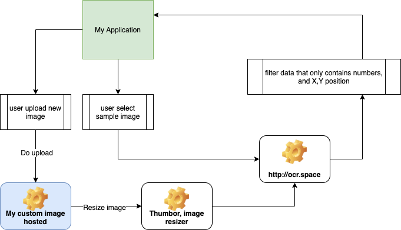

# OCR Scanner

## Todo list

- [x] Create basic UI
- [x] Use sample images
- [x] Use https://ocr.space as OCR webservice
- [x] Show yellow box based on webservice result
- [x] Able to click the yellow box and show alert
- [x] Upload image

## How I built this

I use ReactJS as the main library in this application, for the user interface I use TailwindCSS, and the OCR service I use http://ocr.space, I try to use Google Vision API and it's quite complicated for beginners who don't have experience in machine learning, so http://ocr.space is a really good option because its quite straightforward.

To handle user upload, I created an API service so that users can freely upload images, this API service is built with Laravel. When the user uploads an image, the application will give the user a URL of the uploaded image.

After the upload process, there is a process to resize the image, I do this process using the thumbor service. After that the image is sent directly to http://ocr.space

## Flowchart

